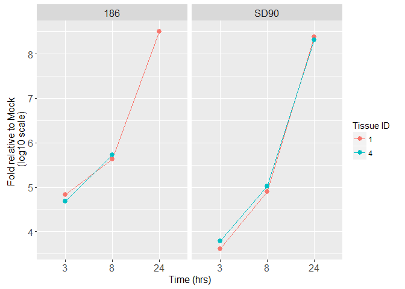
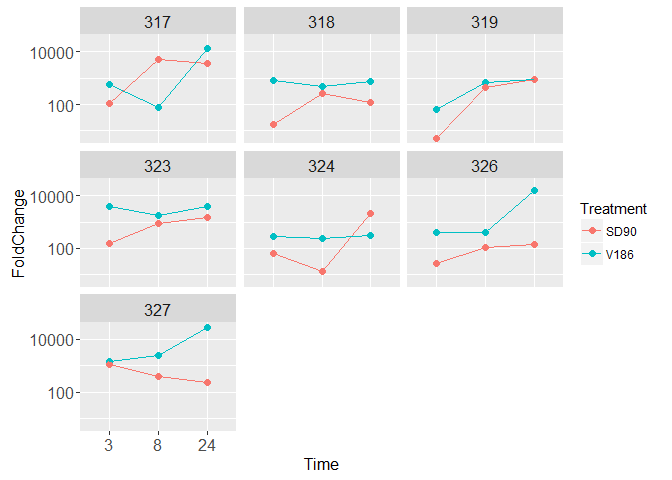
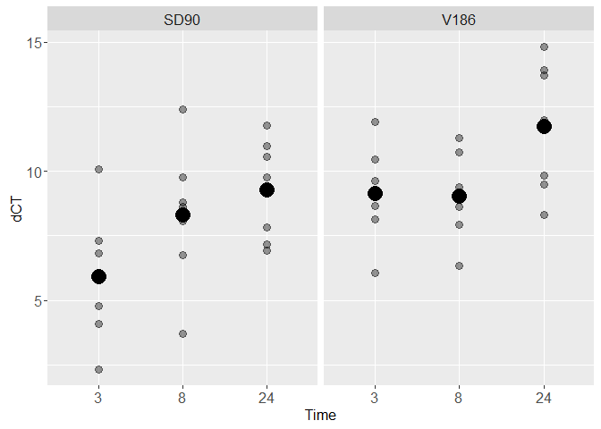

These data are from qPCR experiments done by Erik Layton(Corey/Zhu lab) using the same RNA that was used on the epithelial and explant microarray experiments.

We chose one HSV2 gene (ICP27, Immediate Early) and used beta actin (ACTB) as a housekeeper for the epithelial cell assay. The assays use a FAM dye label and a non-fluorescent quencher.

Epithelial Cell Results
-----------------------

Caveats for epithelial cell qPCR data:

We weren't able to find the RNA from the epithelial cells donor 3

We excluded the sample that was "3E" on the microarray (HVE 4, 24hr, V186) because we wouldnt be able to compare it to the microarray results (it was excluded because of a possible pipetting error).

These replicates got "Undetermined" results from the qPCR machine, but all were Mock samples and the concentration looks ok.

<table>
<colgroup>
<col width="15%" />
<col width="16%" />
<col width="9%" />
<col width="9%" />
<col width="18%" />
</colgroup>
<thead>
<tr class="header">
<th align="center">TissueID</th>
<th align="center">Treatment</th>
<th align="center">Time</th>
<th align="center">Gene</th>
<th align="center">newNanodrop</th>
</tr>
</thead>
<tbody>
<tr class="odd">
<td align="center">1</td>
<td align="center">Mock</td>
<td align="center">8</td>
<td align="center">ICP27</td>
<td align="center">197.6</td>
</tr>
<tr class="even">
<td align="center">4</td>
<td align="center">Mock</td>
<td align="center">24</td>
<td align="center">ICP27</td>
<td align="center">228.6</td>
</tr>
<tr class="odd">
<td align="center">4</td>
<td align="center">Mock</td>
<td align="center">8</td>
<td align="center">ICP27</td>
<td align="center">157.6</td>
</tr>
</tbody>
</table>

Analysis:

-   For both genes, calculate the average of the sample replicates

-   dCT = Average ICP27 CT - Average ACTB CT

-   ddCT = Treatment dCT - Average Mock dCT

-   Amount of target normalized to housekeeper and relative to Mock = 2^-ddCT

This is a plot of the fold change in the ICP27 gene on a log10 scale. Each panel shows data from a different tissue donor. The missing sample on the right panel is the one we left out intentionally.

Conclusions
-----------

-   Similar patterns between the two donors.

-   Concentrations of ICP27 increased over time in both V186 and SD90 infected epithelial cell samples.

-   SD90 started out lower (relative to housekeeper and Mock), but both reached approximately the same concentration at 8 and 24hr.

Explant Results
---------------

For these samples , Erik did 2 replicates of each sample but no housekeeping gene and we didn't use the Mock samples since the explants were not size-standardized (so we don't know if more housekeeper/Mock = more expression, or, if that sample just had a bigger explant).

Two samples had undetermined values. Maybe the concentrations were too low? For these, I used the value of the other replicate instead of the average of the two.

<table>
<colgroup>
<col width="15%" />
<col width="16%" />
<col width="16%" />
<col width="18%" />
</colgroup>
<thead>
<tr class="header">
<th align="center">TissueID</th>
<th align="center">Timepoint</th>
<th align="center">Treatment</th>
<th align="center">newNanodrop</th>
</tr>
</thead>
<tbody>
<tr class="odd">
<td align="center">319</td>
<td align="center">3</td>
<td align="center">SD90</td>
<td align="center">4.89</td>
</tr>
<tr class="even">
<td align="center">324</td>
<td align="center">8</td>
<td align="center">SD90</td>
<td align="center">5.47</td>
</tr>
</tbody>
</table>

Method for analysis of explant samples:

We did not use a housekeeper or the Mock as controls since the explants weren't size standardized.

-   Average the sample replicates

-   dCT = 40 - Average CT (because CT of 40 = zero amplification)

Here are plots of dCT for each donor and then all together

 

Conclusion
----------

-   In 6 of 7 donors, concentrations of ICP27 were either the same for both treatments or higher for V186 infected explants.

-   Erik said that based on his experience, he would say that SD90 did actually infect the explants.
