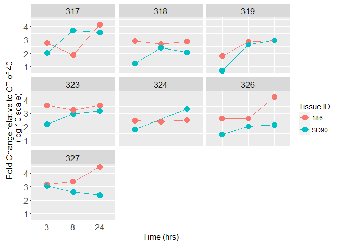
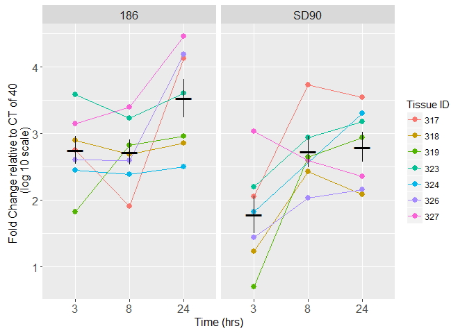

These data are from qPCR experiments done by Erik Layton (Corey/Zhu lab) using the same RNA that was used on the epithelial and explant microarray experiments.

We chose one HSV2 gene (ICP27, Immediate Early) and used beta actin (ACTB) as a housekeeper for the epithelial cell assay. The assays use a FAM dye label and a non-fluorescent quencher. Samples were assayed in replicate.

For both cells and explant experiments, samples had different concentrations but were standardized by volume:

-   The same volume of RNA from each sample was used make cDNA, then equal volumes of the resulting cDNA went into the qPCR reaction.

Epithelial Cell Results
-----------------------

Caveats for epithelial cell qPCR data:

-   We weren't able to find the RNA from the epithelial cells donor 3

-   We excluded the sample that was "3E" on the microarray (HVE 4, 24hr, V186) because we wouldnt be able to compare it to the microarray results (it was excluded because of a possible pipetting error).

-   I don't think that Erik did a validation for this experiment to show that the efficiencies of the target and refernce were approximately equal, but I assume that they have done this in their lab for other assays using these genes.

These replicates got "Undetermined" results from the qPCR machine, but all were Mock samples and the concentration looks ok.

<table>
<colgroup>
<col width="15%" />
<col width="16%" />
<col width="9%" />
<col width="9%" />
<col width="18%" />
</colgroup>
<thead>
<tr class="header">
<th align="center">TissueID</th>
<th align="center">Treatment</th>
<th align="center">Time</th>
<th align="center">Gene</th>
<th align="center">newNanodrop</th>
</tr>
</thead>
<tbody>
<tr class="odd">
<td align="center">1</td>
<td align="center">Mock</td>
<td align="center">8</td>
<td align="center">ICP27</td>
<td align="center">197.6</td>
</tr>
<tr class="even">
<td align="center">4</td>
<td align="center">Mock</td>
<td align="center">24</td>
<td align="center">ICP27</td>
<td align="center">228.6</td>
</tr>
<tr class="odd">
<td align="center">4</td>
<td align="center">Mock</td>
<td align="center">8</td>
<td align="center">ICP27</td>
<td align="center">157.6</td>
</tr>
</tbody>
</table>

Analysis using the Relative (ddCT) method:

-   For both genes, calculate the average of the sample replicates.

-   dCT = Average ICP27 CT - Average ACTB CT

-   ddCT = Treatment dCT - Average Mock dCT

-   Amount of Target gene normalized to housekeeper, and relative to Mock sample = 2^-ddCT

This is a plot of the amount of the ICP27 gene normalized to the housekeeper and relative to Mock (log10 scale). Each panel shows data from a different tissue donor. The missing sample on the right panel is the one we left out intentionally.

Conclusions
-----------

-   Similar patterns between the two donors.

-   Concentrations of ICP27 increased over time in both V186 and SD90 infected epithelial cell samples.

-   At 3 and 8 hours, there was less ICP27 RNA detected in the samples treated with SD90 than those treated with V186.

-   In the patient where we had data for both treatments at 24hrs, the amount of ICP27 detected was very similar

Explant Results
---------------

For these samples, Erik did not use a housekeeping gene and we didn't use the Mock samples since the explants were not size-standardized. All explants were exposed to the same amount of virus, but if an explant used for the Mock treatment was bigger than a "treated" explant, and therefore had more cellular RNA, the relative method of analysis would be inaccurate.

Two samples had undetermined values. Maybe the concentrations were too low? For these, I used the value of the other replicate instead of the average of the two.

<table>
<colgroup>
<col width="15%" />
<col width="16%" />
<col width="16%" />
<col width="18%" />
</colgroup>
<thead>
<tr class="header">
<th align="center">TissueID</th>
<th align="center">Treatment</th>
<th align="center">Timepoint</th>
<th align="center">newNanodrop</th>
</tr>
</thead>
<tbody>
<tr class="odd">
<td align="center">319</td>
<td align="center">SD90</td>
<td align="center">3</td>
<td align="center">4.89</td>
</tr>
<tr class="even">
<td align="center">324</td>
<td align="center">SD90</td>
<td align="center">8</td>
<td align="center">5.47</td>
</tr>
</tbody>
</table>

Method for analysis of explant samples:

-   Average the sample replicates

-   dCT = 40 - Average CT (because CT of 40 = zero amplification)

-   Fold Change = 2^dCT

Here are plots of fold change for each donor. The "Fold Change" is relative to an assumed Mock avg CT of 40.

Here is a plot of the same data but with all of the the donors together. Black dots are the mean and error bars represent one standard error from the mean.

Conclusions
-----------

Erik's remarks on the data:

-   SD90: "What you need to note is that the starting point is very different for each sample.You can't draw a whole lot of conclusions for this, because while you may have added the same amount of virus to each one, the MOI of each sample differed a lot."

-   V186: "You guys were worried that your virus didn't infect. It did. It also grew, I can't say how much without some better controls, I'm confident saying that it did proliferate inside the biopsies."

<!-- -->

    ## R version 3.1.2 (2014-10-31)
    ## Platform: x86_64-w64-mingw32/x64 (64-bit)
    ## 
    ## locale:
    ## [1] LC_COLLATE=English_United States.1252 
    ## [2] LC_CTYPE=English_United States.1252   
    ## [3] LC_MONETARY=English_United States.1252
    ## [4] LC_NUMERIC=C                          
    ## [5] LC_TIME=English_United States.1252    
    ## 
    ## attached base packages:
    ## [1] stats     graphics  grDevices utils     datasets  methods   base     
    ## 
    ## other attached packages:
    ## [1] ggplot2_2.0.0     reshape2_1.4.1    pander_0.5.2      plateR_0.2.0.9000
    ## [5] stringr_1.0.0     dplyr_0.4.3      
    ## 
    ## loaded via a namespace (and not attached):
    ##  [1] assertthat_0.1   colorspace_1.2-6 DBI_0.3.1        digest_0.6.8    
    ##  [5] evaluate_0.7.2   formatR_1.2      grid_3.1.2       gtable_0.1.2    
    ##  [9] htmltools_0.2.6  knitr_1.11       labeling_0.3     lazyeval_0.1.10 
    ## [13] magrittr_1.5     munsell_0.4.2    parallel_3.1.2   plyr_1.8.3      
    ## [17] R6_2.1.1         Rcpp_0.12.0      rmarkdown_0.8    scales_0.3.0    
    ## [21] stringi_0.5-5    tools_3.1.2      yaml_2.1.13
